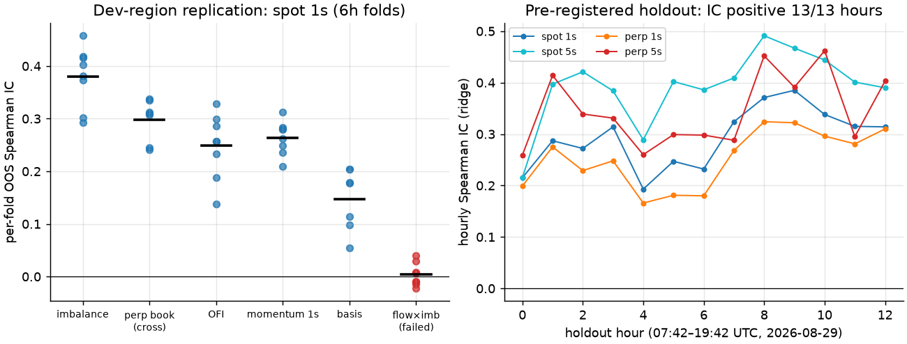
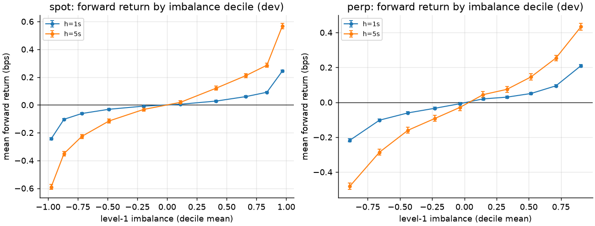
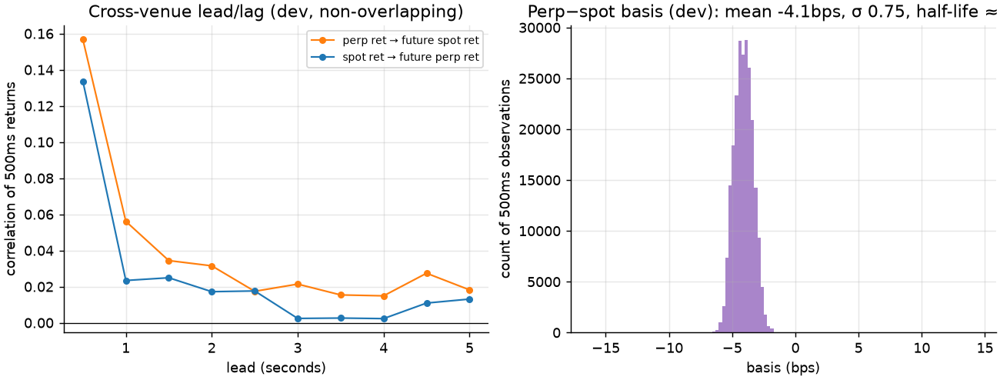
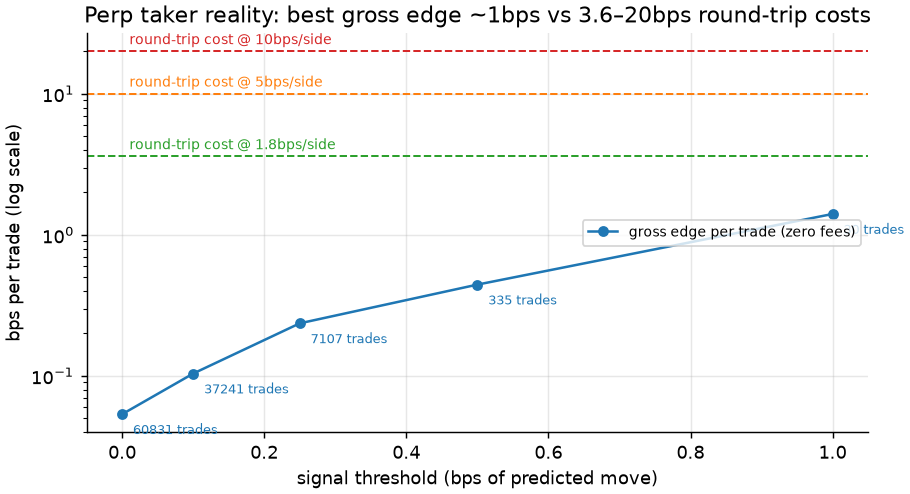
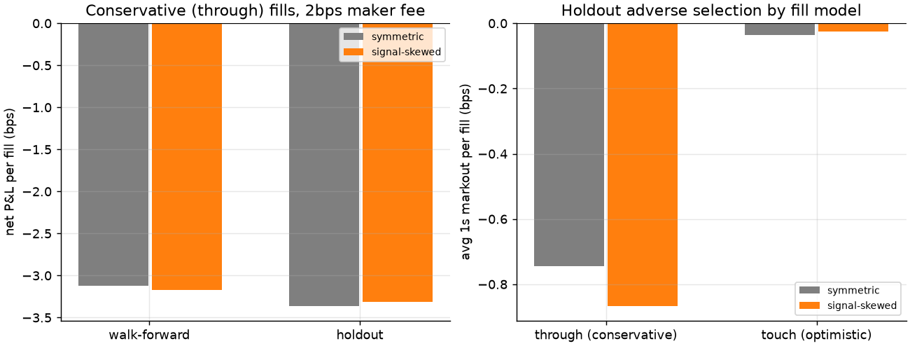

# BTC Microstructure: Who Can Actually Monetize the Order Book?

Two-phase research project on live Binance market data. **v1** asked whether
BTC/USDT order-book imbalance predicts short-horizon moves and survives taker
costs (answer: predicts, doesn't survive). **v2** collected two days of
synchronized **spot + perpetual-futures** books and trades, pre-registered a
final holdout, systematically searched interpretable signals for replicating
alpha, and tested whether the information helps a **maker** instead.

## TL;DR

- **Short-horizon prediction is real, large (statistically), and replicates
  everywhere.** Book imbalance predicts 1–5s mid moves with out-of-sample
  Spearman IC 0.32–0.39 on both spot and perp, positive in 8/8 development
  folds and — on a 12-hour holdout time-stamped *before the data existed* —
  in **13/13 hourly blocks** (ridge signal: IC 0.30 spot@1s, 0.43 spot@5s).
- **The perpetual leads spot.** Perp book state predicts spot's next 1–5s at
  IC ≈ 0.30 (7/7 folds + holdout 0.26); the reverse is consistently weaker
  (≈0.24). Return lead/lag confirms it at 0.5–2s lags. Fragmented venues,
  one information flow — priced on the perp first.
- **Nobody paying fees can trade it as a taker.** The EV rule (trade only
  when predicted move > round-trip cost; "no trade" allowed) selected **NO
  TRADE** on every venue/horizon at real fees — and that frozen policy held
  on the holdout. Best gross edge at the strictest threshold: ~1.4bps/trade,
  vs 3.6bps round-trip at the *cheapest* futures taker tier tested.
- **The maker rescue mostly failed — and the holdout caught it.** Signal-skewed
  quoting halved fills and total losses, but the per-fill improvement seen
  in-sample did **not** replicate out-of-sample (holdout: −3.37 symmetric vs
  −3.31 skewed bps/fill, conservative fills). On a 1-tick book, spread
  capture (~0.007bps!) cannot pay for adverse selection (−0.5 to −1bps
  markout) plus a 2bps maker fee. The signal's real defensive value is
  *exposure reduction*, not fill-quality improvement.
- **Net conclusion:** the order book broadcasts genuine short-horizon
  information; at retail/VIP0 economics there is no way to monetize it on
  either side of the spread. It is priced infrastructure — owned by whoever
  has rebate-tier fees and single-digit-millisecond latency.

## Data

| | spot | perp (USDS-M) |
|---|---|---|
| Streams | `depth20@100ms` + `aggTrade` | `depth20@100ms` + `trade` |
| Clean top-20 snapshots | 1,665,028 | 1,484,266 |
| Trades | 1,731,703 | 5,014,096 |
| Clean coverage | ≈46 h | ≈44 h |
| 500 ms analysis rows | 333,015 | 317,038 |

Aug 25 pilot (2.2h) + continuous capture 2026-08-27 19:42 → 08-29 19:42 UTC,
spanning Asia/EU/US sessions, quiet overnight tape and a violent burst
(276k perp trades in 15 min). Known gaps (machine sleep in v1; a 2.5h
Binance-futures connectivity outage on 08-28) are NaN-masked, never bridged.
Local receive clock is the analysis clock (spot depth carries no exchange
timestamp; measured clock offset ~−25ms documented).

## Method — designed to be hard to fool

- **Pre-registered holdout**: everything after 2026-08-29 07:42 UTC (declared
  27 h in advance) untouched until one final evaluation with policies frozen
  at the 24 h checkpoint. All selection used walk-forward folds only.
- **Signal quality separated from strategy P&L**: every candidate evaluated
  by per-6h-fold non-overlapping Spearman IC, sign consistency, and
  vol/liquidity/session conditioning — before any trading question.
- Leakage defenses: timestamp-validated labels, strictly-past features,
  leakage-injection tests, gap-masked rolling stats; 38 tests.
- Execution realism: venue-correct fees, EV-rule thresholds with a legal
  no-trade optimum, spot treated long-only, maker sim with 100 ms quote
  latency, conservative trade-through fills (touch fills as a labeled
  optimistic bracket), inventory caps, liquidation-adjusted P&L.

## Results

Replication and the pre-registered holdout:



The signal itself (development region):



The cross-venue structure — perp leads, basis reverts in ~5s:



Why takers can't touch it:



And the maker experiment, where the holdout did its job:



## Alpha candidates, ranked (final)

| # | Candidate | Statistical strength | Robustness | Economics | Verdict |
|---|-----------|---------------------|------------|-----------|---------|
| 1 | Perp→spot information lead | IC ≈0.30, t≈20 | 7/7 folds + holdout | untradable at spot fees; execution-timing value | **Real information, no direct trade** |
| 2 | Book imbalance / OFI (own venue) | IC 0.25–0.39 | 8/8 folds + 13/13 holdout hours | gross edge ≤1.4bps vs ≥3.6bps costs | **Real, priced in by fee structure** |
| 3 | Signal-gated maker exposure reduction | halves fills & total losses | held on holdout | cannot flip VIP0 sign; per-fill quality gain failed replication | **Downgraded by holdout** |
| 4 | Basis convergence (spot leg) | IC 0.16, σ_basis 0.75bps, HL≈5s | 7/7 folds | ~0.5bps moves vs 10bps spot fees | **Too small** |
| 5 | Flow×imbalance interaction | IC ≈0.00 | 50–62% sign | — | **Failed cleanly** |

## What failed (kept deliberately)

Flow×book interaction (dead on both venues); basis→perp leg (t≈−2, wrong
venue carries convergence); maker per-fill quality improvement (in-sample
mirage, killed by the holdout); every taker policy at real fees; and the v1
microprice question (microprice ≡ mid + (spread/2)·imbalance on a 1-tick
book — same signal, different clothes).

## Limitations

Two days, one exchange, no weekend, one basis regime (perp under spot,
negative carry, post-event). Passive fills bracketed (through/touch), not
known — queue position is unobservable in public data; resting size would
itself change the queue. Holdout covers EU+US hours only. Clock offset means
absolute latency is approximate; relative/cross-venue timing is clean.

## Next experiments

1. Rebate-tier maker economics: rerun the quoting sim at −0.5 to 0bps
   effective fees with realistic queue-position priors.
2. Perp→spot signal as an *execution-timing* overlay: measure implementation
   shortfall for a parent order with and without it.
3. A week+ capture spanning a positive-basis regime and a weekend.
4. Depth-aware quoting (join deeper levels where adverse selection is lower).

## Reproduce

```bash
uv venv --python 3.11 .venv
uv pip install -p .venv/bin/python websockets pandas numpy pyarrow scikit-learn matplotlib pytest
.venv/bin/python -m src.collect --symbol BTCUSDT --venue spot --duration-minutes 2880   # + --venue perp
.venv/bin/python -m src.preprocess && .venv/bin/python -m src.features && .venv/bin/python -m src.labels
.venv/bin/python -m src.signals --venue spot && .venv/bin/python -m src.models --venue spot   # + perp
.venv/bin/python -m src.backtest --venue perp && .venv/bin/python -m src.maker --venue perp
.venv/bin/python -m src.leadlag && .venv/bin/python -m src.plots
.venv/bin/python -m pytest -q
```

Full commands in `RUNBOOK.md` · memo in `reports/research_note.md` · project
state and interview prep in `STATUS.md`.
