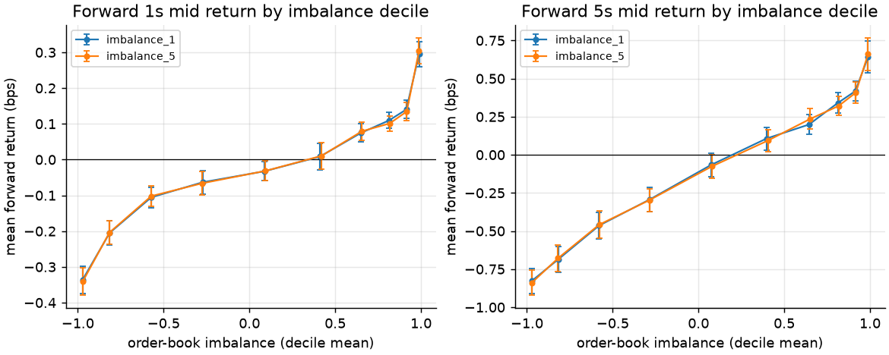
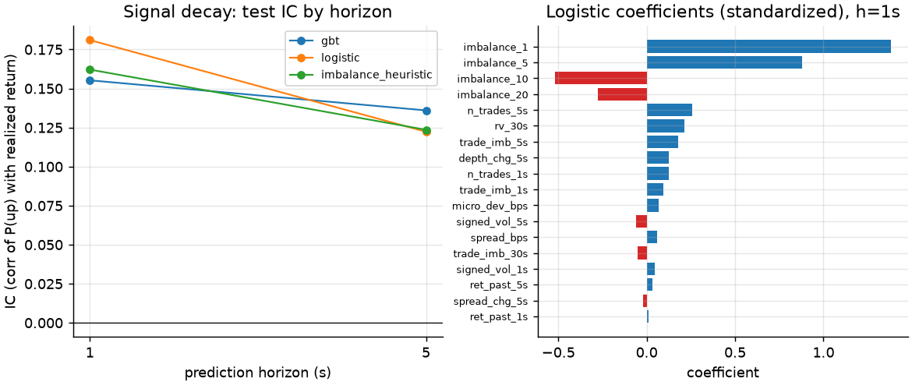
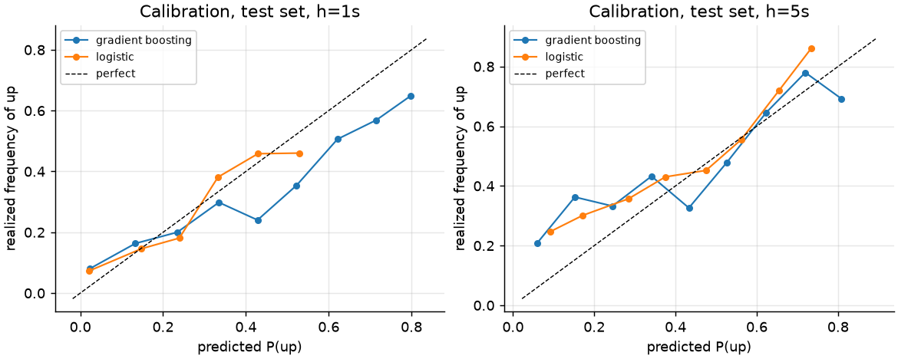
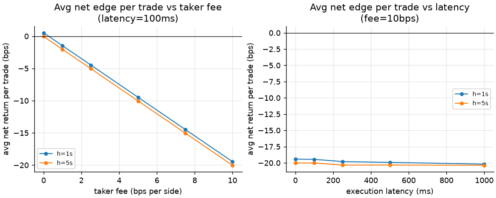
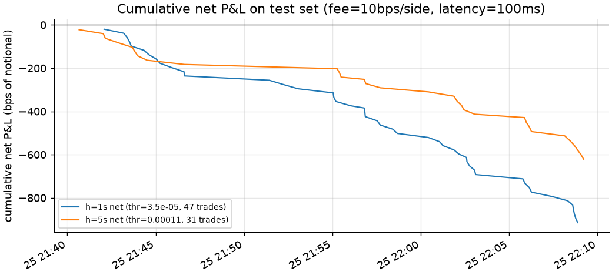

# BTC Microstructure: Does Order-Book Imbalance Survive Execution Costs?

A one-day research project on live Binance Spot BTCUSDT market data: capture
the order book and trade tape, test whether book imbalance predicts
short-horizon mid-price moves, and — the actual question — whether the edge
survives spread, fees, and latency for an aggressive (taker) trader.

## TL;DR

- **Order-book imbalance robustly predicts 1–5 s BTC mid-price moves.** The
  imbalance-decile → forward-return curve is cleanly monotone (−0.34 to
  +0.30 bps at 1 s); direction AUC is 0.74 from raw level-1 imbalance alone;
  a ridge predicted-return signal reaches IC 0.19 at 1 s (0.18 on
  non-overlapping samples, p ≈ 8e-13) on a held-out chronological test set.
- **The signal even beats the spread**: BTCUSDT's spread is one tick
  (~0.0013 bps) 99.9% of the time, and strong signals earned **+0.52 bps
  gross per trade** at 1 s after crossing it.
- **It does not survive taker fees.** At Binance's standard 10 bps/side taker
  fee, every simulated trade lost money (−19.5 bps/trade net). Breakeven
  requires ~**0.26 bps/side** — ~40× below the standard tier and below even
  top VIP taker tiers.
- **The signal dies in about one second.** Adding 1,000 ms of execution
  latency erases the entire gross edge (+0.58 → −0.19 bps); IC falls by a third
  from 1 s to 5 s horizons, and the 5 s gross edge is already negative.
- **Conclusion:** this is information for market makers (quote skewing,
  adverse-selection avoidance), not a taker strategy. A negative economic
  result, reported as measured.

## Research question

BTC/USDT top-of-book state is public and updates ~10×/second. If the bid
queue is much heavier than the ask queue, the next mid move should be up.
Does that information survive realistic trading frictions — spread, taker
fees, and latency — or is it only monetizable by fee-advantaged makers?

## Data

- **Venue/instrument:** Binance Spot, BTCUSDT, public websocket streams only
  (no API keys, no orders).
- **Streams:** partial book depth, top 20 levels @ ~100 ms
  (`depth20@100ms`), and aggregate trades (`aggTrade`).
- **Period:** 2026-08-25 18:46–22:55 UTC; ~134 clean minutes after removing
  capture gaps; BTC in $78.2k–79.2k.
- **Size:** 80,587 book snapshots, 109,563 trades, 15,975 analysis rows on a
  500 ms grid.
- Raw events stored as gzipped JSONL with local receive timestamps;
  processed tables in Parquet. Spot depth snapshots carry no exchange
  timestamp, so the local receive clock is the analysis clock (median trade
  receive latency ~64 ms).

## Features

All computed strictly from data received at or before each grid time:

- **Imbalance** `(Q_bid − Q_ask)/(Q_bid + Q_ask)` aggregated over top 1/5/10/20 levels.
- **Microprice** (size-weighted top-of-book price) deviation from mid — which
  is algebraically `(spread/2) × imbalance₁`, so with a constant 1-tick
  spread it duplicates imbalance; documented rather than double-counted.
- **Trade flow:** signed volume (aggressor side from the `m` flag), trade
  counts, buy/sell imbalance over 1/5/30 s windows.
- **Dynamics:** past 1/5 s returns, 30 s realized volatility, 5 s spread and
  depth changes.

## Method

- 500 ms analysis grid (chosen after inspecting snapshot spacing; raw 100 ms
  events are heavily autocorrelated).
- Labels: forward log mid returns at 1 s and 5 s via timestamp-validated
  shifts; a leakage test injects a future price jump and asserts only labels
  move.
- **Chronological 60/20/20 train/val/test split** — no random splits.
  Trading thresholds chosen on validation only.
- Models: unconditional baseline, raw-imbalance heuristic, logistic
  regression, HistGradientBoosting (direction), ridge regression (returns —
  the economic signal). Accuracy is not headlined: 73% of 1 s intervals have
  zero mid change.
- Execution test: signal > threshold → buy at prevailing ask after
  configurable latency, exit at bid after the horizon (mirrored short);
  one position at a time; configurable taker fee; fee/latency sensitivity grids.

## Results

Imbalance → forward return (train+val period):



Signal decay and what the linear model uses:



Predicted probabilities are roughly calibrated out-of-sample:



The economics — gross edge exists, fees erase it, latency erodes it:





| Metric (test set) | h = 1 s | h = 5 s |
|---|---|---|
| Direction AUC (raw imbalance) | 0.74 | 0.67 |
| IC, ridge signal (non-overlap) | 0.18 | 0.12 |
| Trades at chosen threshold | 47 | 31 |
| Avg gross edge / trade | +0.52 bps | −0.05 bps |
| Avg net @ 10 bps taker fee | −19.5 bps | −20.0 bps |
| Breakeven fee | ~0.26 bps/side | — (gross < 0) |

## Trading reality check

- **Spread:** ~1 tick 99.9% of the time — crossing it costs ~0.001 bps.
  Not the binding constraint on this instrument.
- **Fees:** the entire result. 10 bps/side standard taker fee vs ~0.5 bps
  conditional edge. Even VIP9 taker tiers (~1.6–2 bps) lose.
- **Latency:** the edge decays on a ~1 s timescale; 1,000 ms of delay erases
  it completely. Captured latency floor: ~64 ms median from exchange to this
  machine.
- **Fills:** simulated at displayed top-of-book quotes, no impact — fair for
  small size, optimistic beyond the displayed depth.
- **Adverse selection:** the flip side of the finding — whoever passively
  fills these aggressive orders is systematically picked off by ~0.5 bps.
  The signal's real value is defensive, for quote management.

## What I learned

- The interesting question in HFT research is rarely "is there signal?" —
  it's "who can afford to trade it?" Here the answer is: only rebate-earning
  makers, which is why the effect persists publicly.
- Label design matters more than model choice: 73% of 1 s labels are exactly
  flat, so 0.5-centered classifier thresholds silently produce zero trades;
  I switched the economic signal to predicted return with quantile
  thresholds. Models added almost nothing over raw imbalance — at these
  horizons the book *is* the model.
- Microprice and imbalance are the same signal when the spread is pinned at
  one tick (exact identity: micro − mid = (spread/2)·I₁).

## Limitations

One afternoon, one venue, one regime (~2.2 h usable, mild downward drift —
45 of 47 test trades were shorts, so the long side is weakly tested).
Capture gaps from the collection machine sleeping. No exchange timestamps on
depth snapshots. Partial-depth (top-20) snapshots, not a reconstructed full
book. Overlapping labels (mitigated with non-overlapping IC checks). No
queue-position or impact modeling.

## Next experiments

1. Maker-side simulation: reservation-price quoting skewed by the imbalance
   signal with a conservative trade-through fill model.
2. Multi-day, multi-regime capture; check signal stability by volatility regime.
3. Event-based order-flow imbalance (OFI) vs static snapshot imbalance.
4. Cross-venue comparison (fee/latency structures differ enough to flip the
   economics).

## Reproduce

```bash
uv venv --python 3.11 .venv
uv pip install -p .venv/bin/python websockets pandas numpy pyarrow scikit-learn matplotlib pytest
.venv/bin/python -m src.collect --symbol BTCUSDT --duration-minutes 120
.venv/bin/python -m src.preprocess && .venv/bin/python -m src.features && \
.venv/bin/python -m src.labels && .venv/bin/python -m src.models && \
.venv/bin/python -m src.backtest && .venv/bin/python -m src.plots
.venv/bin/python -m pytest -q
```

See `RUNBOOK.md` for details, `reports/research_note.md` for the full memo,
and `STATUS.md` for project state.
